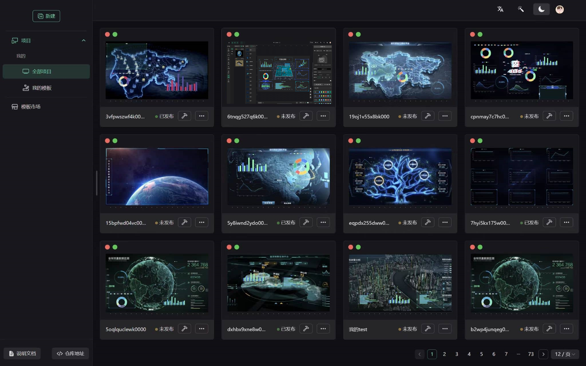
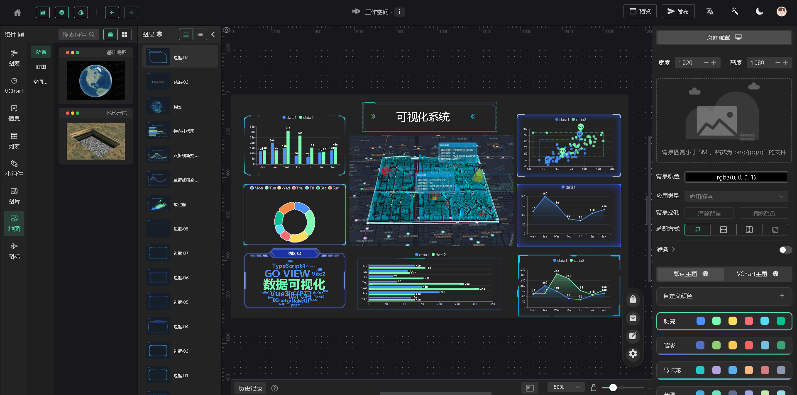
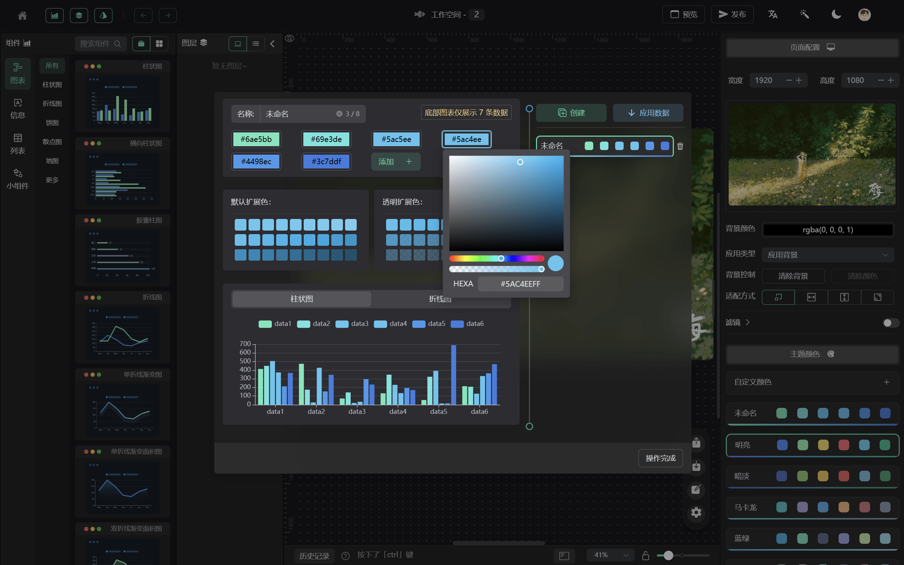

## 介绍：
Go-Cesium-View 专门为 **Cesium** 打造的低代码可视化平台，拖拽即可快速搭建三维大屏。
适合投标演示、项目快速开发等，已被国内众多GIS公司采用！

## 技术栈为：

| 名称                | 版本  | 名称        | 版本   |
| ------------------- | ----- | ----------- | ------ |
| Cesium              | 1.126 | 
| Vue                 | 3.2.x | TypeScript4 | 4.6.x  |
| Vite                | 4.2.x | NaiveUI     | 2.34.x |
| ECharts             | 5.3.x | Pinia       | 2.0.x  |
| 详见 `package.json` | 😁    | 🥰          | 🤗     |

## 开发环境:

| 名称 | 版本    | 名称    | 版本  |
| ---- | ------- | ------- | ----- |
| node | 18.20.x | npm     | 10.7.x|
| pnpm | 8.6.7   | windows | 10    |

## 安装
```
# 1. 安装 pnpm
npm install -g pnpm

# 2. 安装项目依赖
pnpm install

# 3. 启动
pnpm dev

# 4. 编译
pnpm run build
```
## 联系我
- QQ： 1264710065
- 微信：trampjwl

## 主页：


## 工作台：


## 色彩：


## 事件：

